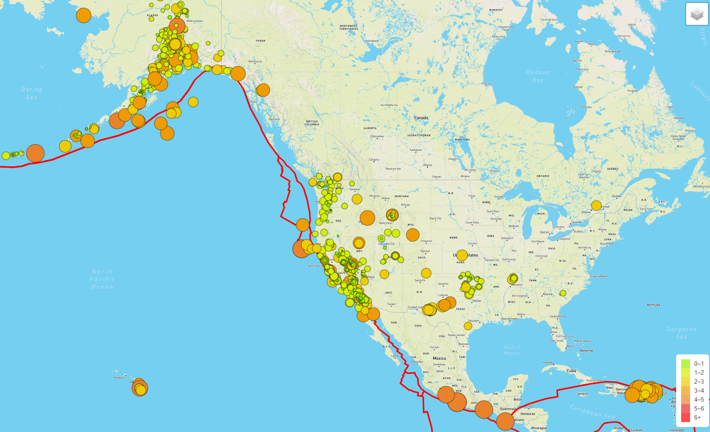
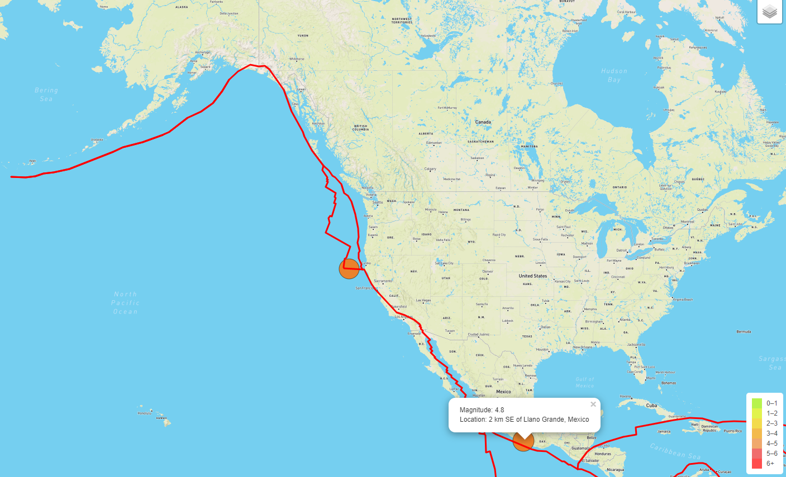

## Mapping Earthquakes

The purpose of this challenge was to apply U.S. Geological Survey (USGS) data of earthquakes recorded over the past seven days, and present them on a worldwide map.

Each earthquake is plotted using a circle that is proportional in size to the magnitude of the earthquake. Colors of the circles are graded by magnitude using green for the smallest earthquakes (magnitude less than 1) through varying shades of yellow, orange, pink and pale red, up to bright red for the strongest earthquakes (mag. 6.0 or greater). The legend of colors is in the lower-right corner of the map.

The default map layer is Mapbox Streets but the user can change the map layer to one of three additional options: Mapbox Satellite, Mapbox Outdoors, or Mapbox Dark. The selector for this is in the toggle box in the upper-right corner of the map.

Overlaying the map in its default view is a map of the boundaries of techtonic plates. These plate boundaries are outlined in bright red. The tectonic plate boundaries are regions of highest seismic activity, so the user can see that most of the world's earthquakes are close to these plate boundaries. The user can turn off this layer by unselecting "Tectonic Plates" in the toggle box.

All of the earthquakes recorded and plotted are displayed in the default view. There is also a second layer of "major" earthquakes consisting of a subset of all of the earthquakes with magnitude of 4.5 or greater. Turning off the "all" earthquakes layer and leaving the "major" earthquakes view on the map enables one to more clearly discern where the strongest earthquakes have occurred. 

Deliverable 1: Add Tectonic Plate Data
Deliverable 2: Add Major Earthquake Data
Deliverable 3: Add an Additional Map
### Map of Earthquakes in North America

Above is the map of earthquakes in North America. Highest concentrations are in the west coast states of the USA (CA, OR, and WA), Alaska, southern Mexico, and Puerto Rico. Most of these earthquakes are near tectonic plate boundaries. There are smaller clusters in the interior of the USA (i.e. TX, OK, NV, and UT) away from the tectonic plate boundaries.

Places that have higher-than-average earthquake activity, that are not close to tectonic plate boundaries, are often near "hot spots" such as the volcanic activity of Hawaii's Big Island and the geothermal activity of Yellowstone National Park.
###  "Major" Earthquakes in North America

While there have been many earthquakes recorded in North America, filtering the earthquakes by selecting "major" earthquakes (mag. >= 4.5) shows that most of these earthquakes were less than 4.5 in magnitude. This map of North American shows only two "major" earthquakes, with the larger of the two (mag. 4.8) recorded in southern Mexico.
###  "Major" Earthquakes in Asia
 
Reviewing the map of "major" earthquakes across the whole world, it appears that the highest concentration of such earthquakes have been recorded in eastern Asia and Oceania. The strongest earthquake (mag. 6.2) was recorded off the southwestern coast of the Indonesian island of Sumatra. 
